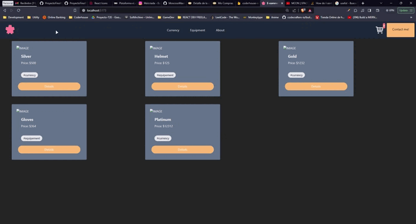

# Project created with Vite

## Idea

E-commerce based on videogames products like currency or equipements

## Demostration GIF

## Dependencies

- react-icons
- react-router-dom

## Dev Dependencies

- TailwindCSS
- eslint
  
## How to run

First at all install dependencies with `npm install`, after that can run on your localhost with `npm run dev`
